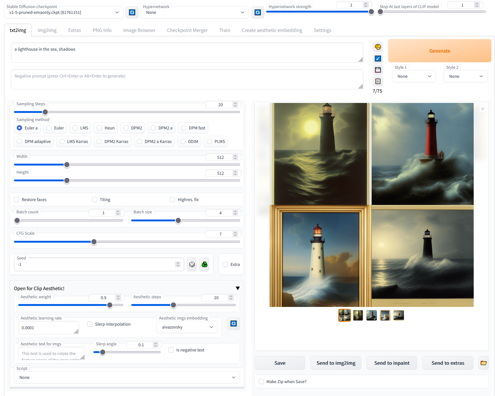

# Aesthetic Gradients



This is an extension for [web ui](https://github.com/AUTOMATIC1111/stable-diffusion-webui).

To install it, clone the repo into the `extensions` directory and restart the web ui:

```commandline
git clone https://github.com/AUTOMATIC1111/stable-diffusion-webui-aesthetic-gradients extensions/aesthetic-gradients
```

Original repo: https://github.com/vicgalle/stable-diffusion-aesthetic-gradients

Most of the code here has been written by MalumaDev, in this PR: https://github.com/AUTOMATIC1111/stable-diffusion-webui/pull/2585

If the original author or MalumaDev creates a copy or a clone of this repository with a version of the
extension that he is willing to develop/maintain, I will replace this repo with a link to his.
